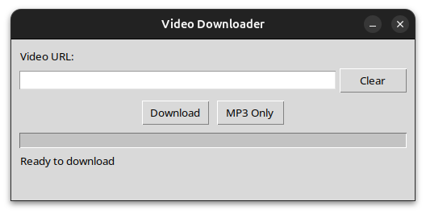

# AutoPosting Video Downloader



A Python-based video downloader with Tkinter GUI that enables easy video and audio downloads from various platforms using yt-dlp. Features dual download modes, real-time progress tracking, URL validation, pop-up error handling, automatic downloads to system Downloads folder, and comprehensive logging for download history.

## Features
- Modern GUI interface with Tkinter
- Dual download modes: Video and MP3 audio extraction
- Real-time download progress tracking
- Video downloading using yt-dlp (best quality)
- MP3 audio extraction with best audio quality
- URL validation with pop-up error messages
- Automatic downloads to system Downloads folder
- Comprehensive logging system for download history
- Clear button for easy URL management
- Support for various video platforms

## Requirements
- Python 3.x (with tkinter - included in most Python installations)
- yt-dlp
- requests
- python-dotenv
- FFmpeg (for MP3 audio extraction)

## Installation
1. Clone this repository
2. Create a virtual environment:
```bash
python3 -m venv .venv
source .venv/bin/activate
```
3. Install dependencies:
```bash
pip install -r requirements.txt
```
4. Install FFmpeg for MP3 audio extraction:
   - **Windows:** `winget install FFmpeg`
   - **Linux:** `sudo apt install ffmpeg`
   - **macOS:** `brew install ffmpeg`

## Usage
Launch the GUI application:
```bash
python main.py
```
1. Paste or type the video URL in the input field
2. Choose your download option:
   - **"Download"** - Downloads the full video
   - **"MP3 Only"** - Extracts and downloads audio as MP3
3. Watch the progress bar for download status
4. Use "Clear" button to clear the URL field
5. Downloads are automatically saved to your system's Downloads folder
   - Videos: `VideoTitle.ext`
   - Audio: `VideoTitle_audio.mp3`

## Logging
All download activities are logged in `download.log` file, including:
- Video and audio download attempts
- Successful downloads
- Errors and exceptions
